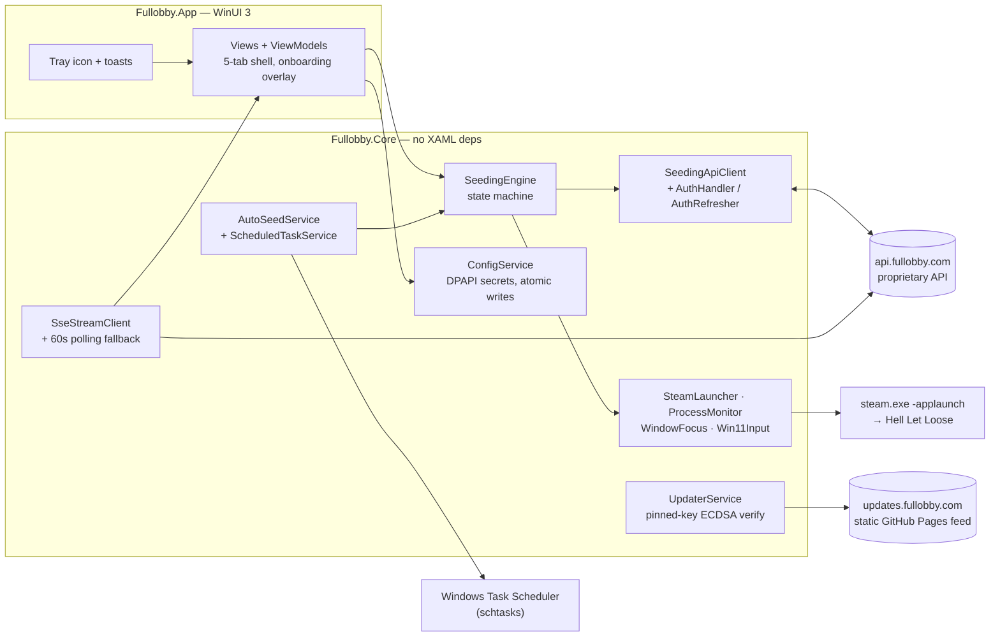
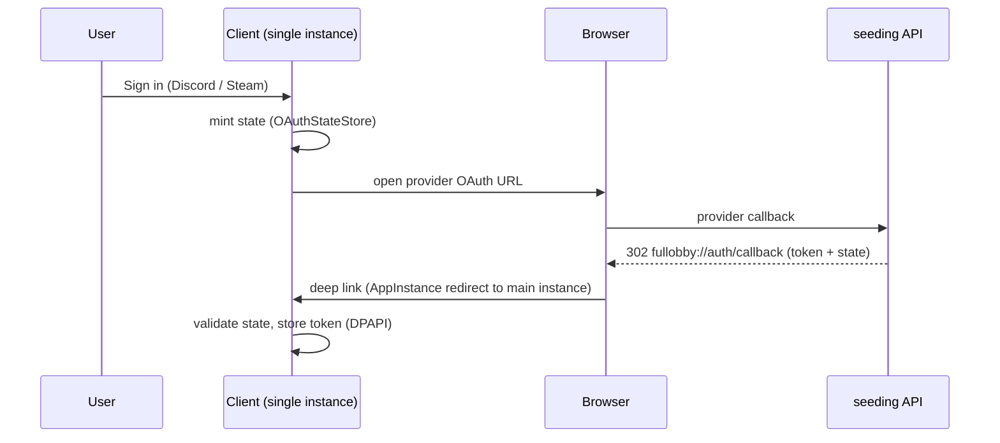

# Fullobby — Architecture

C# + WinUI 3 (Windows App SDK) desktop app for Hell Let Loose server seeding.
This document is the durable architecture reference.

## Solution layout

```
/src/Fullobby.App         WinUI 3 app — net9.0-windows10.0.22621.0, min 10.0.22000.0 (Windows 11 only).
                             Views, ViewModels, App.xaml, custom Main (DISABLE_XAML_GENERATED_MAIN).
/src/Fullobby.Core        Class library — all non-UI logic (API, SSE, seeding engine, config,
                             DPAPI, process/Win32, autoseed, updater). No XAML deps; testable.
/src/Fullobby.Core.Tests  xUnit coverage (crypto, deep-link parse, autoseed time, config atomic
                             writes, seeding state, schedule XML, etc.).
/installer                   Inno Setup script (.iss) — unpackaged setup.exe.
/tools/Fullobby.MockApi   Local mock of the seeding API for offline UI/dev testing.
```

## Key choices

- **.NET 9** + **Windows App SDK 1.8.x**; **CommunityToolkit.Mvvm** (source-gen MVVM);
  **Microsoft.Extensions.Hosting + DI** — background workers (SSE, heartbeat, missed-autoseed
  poller, bootstrapper) are `IHostedService`s registered by `AddFullobbyCore`.
- **Deployment: UNPACKAGED, self-contained, Inno Setup `setup.exe`** (not MSIX). Preserves the
  self-update flow (download installer → SHA-256 verify → run), lets the installer write
  `fullobby://` protocol keys directly, and keeps toasts/tray working unpackaged.
- **App stays non-elevated** — toasts break when elevated and the HKLM Steam path is read-only.
- NuGet: `H.NotifyIcon.WinUI` (tray), WAS `AppNotificationManager` (desktop toasts),
  `System.Security.Cryptography.ProtectedData` (DPAPI, `dpapi:<base64>` format),
  `Microsoft.Extensions.Http.Resilience`/Polly (timeout + backoff), hand-rolled SSE over
  HttpClient streaming (reconnect + 60s polling fallback), `System.Text.Json` source-gen,
  **Serilog** (rolling daily logs, 7-file retention), `schtasks.exe` shell-out for Task
  Scheduler, `Microsoft.Windows.CsWin32` for P/Invoke.

## System overview



The update feed is deliberately **not** behind the API — see the cross-repo
section below.

## Subsystem map

| Subsystem | Implementation |
|---|---|
| Seeding state machine | `Core.Seeding.SeedingEngine` (+ `SeedingState`, `SeedingEvent`) |
| API client | `Core.Api.SeedingApiClient`, `Models`/`ApiJson`, `RetryPolicy`/`ResilienceHandler`, `AuthHandler` + `AuthRefresher` + `AuthHeaders` |
| Seeding networks | Multi-tenant communities (limited-beta gate): membership via `SeedingApiClient` (`JoinNetworkAsync`/`GetMyNetworksAsync`/`LeaveNetworkAsync`/`SetNetworkPrioritiesAsync`), state + hard gate in `AccountViewModel` (onboarding network step; re-armed portal on session restore with zero memberships or a `join_a_network` directive — fails open on fetch errors). Seeding status is per network (`NetworkSeedingStatus`); the seed board flattens/groups by network. Join codes are sent and forgotten — never stored client-side. |
| Live stats / SSE | `Core.Api.SseStreamClient : IHostedService` + `SseFrameParser`, `SseConnectionState`, `SeedingStatusCache`, `Core.Servers.LiveStats` |
| Config | `Core.Config.ConfigService` (STJ store, atomic temp+rename, 500ms throttle, DPAPI secrets, `icacls` hardening; no legacy-dir migration) + `Core.Security.DpapiProtector`, `Core.Config.AtomicFile`, `Core.Config.EfficiencyPreference` (per-game power-savings key `efficiency_mode.<gameId>`; one-time migration off the retired global toggle) |
| Steam / process | `Core.Native.SteamLauncher`, `ProcessMonitor`, `SteamPaths` |
| Window focus / input | `Core.Native.WindowFocus` (HLL window find/cache, PostMessage Esc/F13 splash bypass, AttachThreadInput force-focus), `Win11Input` (SendInput + UIA fallback) |
| Auto-seed / scheduling | `Core.Scheduling.AutoSeedService`, `ScheduledTaskService` (schtasks `/create /xml`), `AutoSeedSlot`/`AutoSeedTime`/`AutoSeedState`, `MissedAutoseedMonitor : IHostedService` |
| Backup / restore | `Core.Tools.HllConfigBackupService` (efficiency-INI swap + crash-recovery flag), `ManualBackupService` (hardlink-dedup backups) |
| Game catalog | `Core.Games.GameDefinition` + `GameCatalog` (plain data record — no per-game interface) |
| Tray / notifications | `App` `H.NotifyIcon` `TaskbarIcon` (in `MainWindow.xaml`), `App.Services.ToastService` (AppNotificationManager + `MessageBeep`), `App.Services.InAppToastService` |
| Deep link / single instance | `Core.Activation.DeepLinkParser` + `AppInstance` redirection, `Core.Activation.OAuthStateStore` |
| Startup | `Core.Platform.StartupRegistry` (HKCU Run `Fullobby`) |
| Updater | `Core.Update.UpdaterService` + `UpdateValidation` + `UpdateSignature` + `UpdateInfo` (mandatory pinned-key ECDSA P-256 signature over `(version, sha256)` — private key offline, signing runbook in the private `fullobby-api` repo; HTTPS + trusted-domain + ext + ≤500MB + SHA-256; launches Inno setup.exe; stable/beta `update_channel`) |
| Power | `Core.Native.PowerStatus` (powercfg modern-standby/wake-timer warnings) |
| UI | `App.Views.*Page` + `App.ViewModels.*` (frameless 5-tab shell); onboarding is a 5-step overlay (sign-in → join network → link → nickname → done); the seed surface is a `SplitButton` on efficiency-capable games and the auto-seed countdown resolves through a "Seed now?" dialog (Seed Now / Seed with Power Savings / Cancel), falling back to the remembered per-game choice when unattended |
| Keep-awake | `Core.Native.KeepAwake` (`SetThreadExecutionState` re-asserting thread; held while seeding) |

## WinUI 3 gotchas (load-bearing)

- **Frameless window:** `AppWindowTitleBar.ExtendsContentIntoTitleBar` + `SetTitleBar` + explicit
  drag regions (`InputNonClientPointerSource`); `OverlappedPresenter` for non-resizable.
- **Single instance:** `AppInstance.FindOrRegisterForKey("fullobby-main")` +
  `RedirectActivationToAsync`; the main instance handles redirected `fullobby://` activations via
  the `Activated` event.
- **Unpackaged protocol activation:** plain `"exe" "%1"` registry keys surface as **Launch** (not
  Protocol) activation kind — the app self-registers via `ActivationRegistrationManager` on startup,
  and there is a launch-args URI fallback. Cast activation `Data` via the **interface**
  (`IProtocolActivatedEventArgs` / `ILaunchActivatedEventArgs`), not the concrete class.
- **Close-to-tray:** cancel `AppWindow.Closing` and `Hide()`; a real quit sets a flag and
  **disposes the tray icon** (ghost-icon pitfall). `ForceCreate()` the icon on startup.
- **Threading:** hidden windows don't suspend, so background services keep running; marshal UI
  updates via `DispatcherQueue.TryEnqueue`. The seeding engine runs entirely off the UI thread; the
  Win11 `SendInput` fallback needs foreground-focus handling first.
- **MVVM source-gen:** `[ObservableProperty]` partial-property form needs `LangVersion=preview`
  (MVVMTK0045 suppressed, field form used) — revisit on the .NET 10 bump.

## ⚠ Cross-repo coordination (outside this repo)

These depend on the `seeding-api` backend / release infra and can't be verified from this repo:

- OAuth redirect target must be `fullobby://` (auth + provider-link callbacks).
- API base host `https://api.fullobby.com` (configurable via the `api_host` config key).
- **Update feed** is a static GitHub Pages site at `https://updates.fullobby.com`
  (`UpdateConfig.FeedBaseUrl`), **not** the API — so the backend is never in a position to strip the
  pinned-key signature. It serves `latest.json` (stable) / `latest-beta.json` (beta), each with the
  installer's `download_url` (`Fullobby-Setup-<ver>.exe`), matching SHA-256, the full-SemVer
  `version`, **and a populated `signature`**. The client refuses any manifest whose signature is
  missing/invalid. CI emits the manifest with `signature: null`; the maintainer signs `(version,
  sha256)` offline and publishes the finalized manifest to the feed (signing runbook + tooling live in
  the private `fullobby-api` repo).
- **Seeding score** (planned): server-authoritative reward score — design in `docs/SCORING.md`;
  the scoring engine, CRCON score-delta polling, and streak tracking are backend work.
- **Multi-game generalization** (planned): game registry + per-user opt-in, Palworld first —
  product design in `docs/MULTI-GAME.md`, backend gap analysis in the API repo's
  `docs/MULTI-GAME.md`. Involves a coordinated breaking wire change (per-game struct fields →
  game-keyed maps in `SeedingStatusResponse`).
- Provider linking/sign-in for **Epic Games** and **Xbox** is stubbed (disabled) in Settings until
  the backend supports those providers and they're added to `ApiValidation.ValidProviders`.
- **Provider linking commits only on authenticated confirmation.** `link-init` (auth required)
  mints a single-use, HMAC-signed, user-bound link `state` (`link:{user_id}:{ts}:{sig}`, 2-min
  expiry) that the OAuth callback validates and *atomically consumes*. The callback then **stages**
  the verified identity instead of committing it: a fresh link's `auth/link-callback` deep link
  carries `provider` + a single-use `staged` code (10-min TTL), and the client commits it with
  `POST /api/auth/link-confirm` — which the API refuses unless the authenticated caller is the user
  who initiated the link (link-CSRF defense; an already-linked identity still arrives as the legacy
  committed `provider_id`/`linked=true` form). The client needs no extra confirmation dialog: its
  single-use *pending-link* marker (`OAuthStateStore.SetPendingLink`/`ConsumePendingLink`) proves it
  started the flow, and the server's user-match check is the real boundary. A forged deep link the
  client never initiated is dropped by the marker; a stolen staged code is useless without the
  initiating user's credentials.

### OAuth deep-link flow (sign-in)



Provider *linking* differs: the sensitive action completes server-side and the
`auth/link-callback` deep link carries no token or state (see the CSRF bullet
above).

## Build & test

- `dotnet build src/Fullobby.sln -c Release` — build
- `dotnet test src/Fullobby.Core.Tests` — run tests
- Installer: build with Inno Setup against `installer/`.
- Manual end-to-end (needs real API + Steam + HLL): click Seed on a live server → HLL launches,
  joins, splash bypassed, heartbeat in logs, Stop kills the process.
