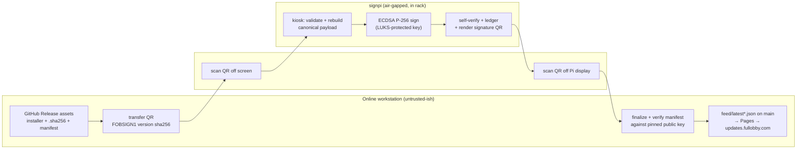

# Offline release-signing rig — design

How the air-gapped signing device ("**signpi**") is built, wired, and operated so that
the manual `(version, sha256)` signing step for each release is **fast, repeatable, and
transcription-proof** — a barcode scanner carries the hash across the air gap instead of
the operator's fingers, and everything lives in one lockable 10-inch GeeekPi rack.

Status: **design / proposal**. Nothing here is built yet. The parts marked
*(proposed)* imply small changes to `.github/workflows/release.yml` and new scripts;
everything else is procedure and hardware.

> **Scope split.** This document covers the **rig and the manual signing procedure**.
> Key generation, key backup/escrow, and key rotation stay in the private `fullobby-api`
> repo (`docs/RELEASE-SIGNING.md`) and are deliberately *not* reproduced here — this repo
> is public. Nothing in this file is secret: the payload format, the public key, and the
> verification rules already ship inside every client
> (`src/Fullobby.Core/Update/UpdateSignature.cs`).

---

## 1. What the manual step actually is today

Every release, CI produces a manifest with `signature: null` and a `payload.txt` asset —
the exact bytes the offline key must sign (`.github/workflows/release.yml`, *Checksum +
update manifest*). The client refuses any manifest without a valid signature
(`UpdateSignature.VerifySignature`), so a release does not auto-update anyone until a
human signs it offline and publishes the finalized manifest into `feed/`.

The canonical payload is defined once, in `UpdateSignature.BuildSignedPayload`:

```
fullobby-update.v1\nversion=<full SemVer>\nsha256=<lowercase hex>
```

UTF-8, LF separators, **no trailing newline**. ECDSA **P-256 / SHA-256**, DER
(`Rfc3279DerSequence`) signature, base64-encoded into the manifest's `signature` field.

The manual work, per release, is therefore:

1. Get `version` (≈ 12 chars) and `sha256` (**64 hex chars**) onto the offline Pi.
2. Sign.
3. Get the base64 signature (≈ 96 chars) back out.
4. Splice it into `latest.json` / `latest-beta.json`, verify, commit to `main`.

Step 1 is the dangerous one to do by hand. Step 3 is the tedious one.

### Why hand-typing is the problem worth solving

A mistyped hash is **not** a security failure — it fails closed. The Pi would sign a
payload nobody can reproduce, the client's `VerifySignature` would reject the manifest,
and the update would simply not install. The cost is **availability and operator time**:
a bad character in a 64-char hex string is invisible on inspection, and you only find out
after publishing to the Pages feed. Two people staring at hex is not a control; a scanner
that reads the bytes machine-to-machine is.

---

## 2. What crosses the air gap



| Direction | Payload | Secret? | Integrity requirement |
|---|---|---|---|
| **In** (workstation → Pi) | `version`, `sha256` | No — both are published in the release | Must be exact. Errors fail closed at step "verify" and cost a redo, not safety. |
| **Out** (Pi → workstation) | base64 DER signature | No — it ships in a public manifest | **Self-verifying.** Any corruption is caught by `openssl dgst -verify` on the online side before publishing. |

**Nothing crossing the gap is confidential.** The only asset the gap protects is the
private key, and the only real threat model for the gap is *code or credentials reaching
the Pi*. That reframes the scanner question: the scanner is not a confidentiality risk,
it's a **keystroke-injection surface** (§5).

### What the signature does and does not bind

| Bound | Not bound |
|---|---|
| `version` (full SemVer) | `download_url` — covered instead by the client's trusted-domain check plus the SHA-256 of the downloaded bytes |
| `sha256` of the installer | `notes` — cosmetic |
| the scheme tag `fullobby-update.v1` | **the channel** — a signature valid for `latest-beta.json` is equally valid in `latest.json` |

The channel gap is real but small: it takes an operator publishing a beta build's manifest
into the stable file. Mitigation is procedural — the finalize script (§7) derives the
target filename from the version's prerelease tag and refuses a mismatch. If we ever want
it cryptographic, that is a `fullobby-update.v2` payload with a `channel=` line, a client
that trusts both tags, then retirement of v1 (the `SchemeTag` constant exists for exactly
this).

---

## 3. Transfer encoding (the QR contract)

### Don't QR the canonical payload

The obvious move — put the literal contents of `payload.txt` in a QR — is wrong. The
payload contains two LF characters. A USB-HID scanner types what it reads, so those LFs
arrive as **Enter presses**, submitting the line early and scattering the rest of the
payload into whatever gets focus next. Multi-line barcode output is also the one area
where scanner models differ most.

Instead, the QR carries a **single-line transfer record** with no control characters, and
the Pi rebuilds the canonical bytes locally with `printf`. The canonical format then has
exactly two implementations — `BuildSignedPayload` in C# and one `printf` on the Pi —
which is what the doc comment on `UpdateSignature` already demands.

### Record format `FOBSIGN1`

```
FOBSIGN1 <version> <sha256>
```

- Single space separators. Neither field can contain a space, so parsing is unambiguous.
- `<version>` — full SemVer, **case preserved** (`0.3.0`, `0.3.0-beta.1`).
- `<sha256>` — 64 lowercase hex.
- No prefix, no trailing whitespace. The scanner appends the terminator (§5), not the data.
- `FOBSIGN1` is a format tag; a future field (channel, expiry) becomes `FOBSIGN2` and the
  Pi rejects unknown tags rather than guessing.

Total length ≈ 75–90 bytes. In QR byte mode at ECC level **M** that is a version 5–7
symbol — small, and every 2D imager reads it off an LCD without ceremony. Render at
**≥ 6 px per module** with a real quiet zone (4 modules of white) and no dark mode
inversion; scanners want dark-on-light.

> **Considered and rejected:** uppercasing the hex to reach QR *alphanumeric* mode (denser,
> more robust). SemVer prerelease tags are case-sensitive (`-beta.1` ≠ `-BETA.1`), so a
> whole-record uppercase changes the signed `version`. Splitting into two QRs to get there
> costs a scan and a synchronization bug. Byte mode is fine at this size.

### Return record

The Pi renders the raw base64 signature as a QR — no tag, no wrapper, ~96 bytes, so the
finalize script can accept a bare paste too. Standard base64 alphabet (`+`, `/`, `=`),
because that is what `Convert.FromBase64String` on the client expects. Print the base64 as
readable text under the QR as a manual fallback.

---

## 4. Producing the QR *(proposed CI change)*

Today CI emits `payload.txt` and echoes the payload into the job summary. Add a third
artifact: the transfer QR as a PNG, so the operator opens one image and scans it.

Sketch for the *Checksum + update manifest* step in `release.yml` (Python is present on
GitHub's Windows runners):

```powershell
# after $hash / $env:VERSION are known
$record = "FOBSIGN1 $env:VERSION $hash"
[System.IO.File]::WriteAllText((Join-Path (Get-Location) "dist/$env:MANIFEST_NAME.transfer.txt"), $record)
python -m pip install --quiet qrcode pillow
python -c @"
import qrcode, sys
img = qrcode.make(sys.argv[1], error_correction=qrcode.constants.ERROR_CORRECT_M, box_size=8, border=4)
img.save(sys.argv[2])
"@ "$record" "dist/$env:MANIFEST_NAME.transfer.png"
```

…and add `dist/${{ env.MANIFEST_NAME }}.transfer.{txt,png}` to the release `files:` list.

**Offline fallback**, if CI's QR is missing or the operator prefers to generate it from
the bytes they hashed themselves — `scripts/make-transfer-qr.ps1` *(proposed)*, or simply:

```bash
qrencode -l M -s 8 -o transfer.png "FOBSIGN1 $VERSION $SHA256"
```

Either way, **the hash that goes in the QR should be one the operator computed locally
from the downloaded release asset** (§8 step 2), not one copy-pasted from a job summary.
That is the difference between signing "what CI says it built" and signing "the bytes
users will actually download".

---

## 5. Scanner design (Tera 2D imager)

A USB barcode scanner is an **HID keyboard**. On the offline side it is therefore an
arbitrary keystroke injector pointed at the machine holding the signing key. The design
has to assume the scanner is hostile and still be safe.

### Required scanner configuration

Configure by scanning the programming codes in the model's manual (Tera's flow is *scan
"Enter Setup" → the setting codes → "Exit Setup"*). Print the exact codes used and keep
them in the rack drawer — a factory reset silently reverts all of this.

| Setting | Value | Why |
|---|---|---|
| Interface | **USB HID keyboard**, wired | No driver; wired keeps an RF receiver out of the air gap |
| Terminator / suffix | **CR only** (no LF, no CRLF) | One submit per scan; CRLF double-submits into the kiosk |
| Prefix | none | The record carries its own tag |
| Keyboard layout / country | **US** | Must match the Pi's console layout — see below |
| Trigger mode | manual trigger only (no auto-sense / continuous) | No accidental scans while the kiosk is at a confirm prompt |
| Symbologies | **QR Code only** (disable 1D and other 2D where the model allows) | Smallest input surface; nothing else is ever scanned here |
| Inter-character delay | raise one step if characters drop | Pi consoles occasionally lose fast HID bursts |
| Caps Lock / case conversion | **off / preserve** | base64 and SemVer prerelease tags are case-sensitive |

**The layout trap.** The scanner emits US-layout HID scancodes. If the Pi's console is
set to GB, DE, or anything else, `/`, `+`, `=`, `-` and `.` land as different characters —
so base64 and SemVer mangle while plain hex looks fine, which is the worst possible failure
mode (it only breaks on prerelease versions and on the return leg). Set the Pi to
`us` explicitly (`/etc/default/keyboard`, `XKBLAYOUT="us"`) and prove it during bring-up by
scanning a QR containing `Test+/=-.aA0` and diffing the result.

### Where the scanner lives — pick one

The inbound leg needs a scanner on the Pi. The outbound leg wants one on the workstation.

| Option | Cost | Residual risk | Notes |
|---|---|---|---|
| **A. Two scanners** — one permanently on each side, neither ever moves | + one cheap 2D scanner | Lowest. Nothing physically crosses the gap. | **Recommended** if you want the strict posture. |
| **B. One scanner on a mechanical 2-port USB switch** | + ~$10 switch | A device that has been attached to an online machine later attaches to the Pi. Theoretical BadUSB / firmware-reflash carrier. | **Recommended default** — pragmatic, and the kiosk (below) blunts keystroke injection. |
| **C. Scanner stays on the Pi; type the 96-char signature by hand** | free | None added | The signature is self-verifying, so typos are caught immediately — but it's 96 characters, every release. |

Option B with the kiosk hardening below is the sensible balance. Do **not** carry a USB
stick across the gap as an alternative; that is a strictly worse version of the same risk
with a filesystem attached.

---

## 6. Pi-side design (`signpi`)

### Kiosk, not a shell

The scanner must never be typing at a shell prompt. On the signing tty, the operator
account's login shell is the signing tool itself (or `getty --autologin` straight into it).
It runs a fixed loop: prompt → read one line → validate → confirm → sign → display →
prompt. Stray keystrokes hit a validator, not `bash`.

Hard rules for the tool:

- `read -r line` into a variable. **Never** `eval`, never `$(...)` on scanned input, never
  interpolate it into a command string.
- Validate before anything else, and reject the whole line on any failure:
  - `^FOBSIGN1 ` tag exactly, exactly two spaces, exactly three fields
  - version: `^[0-9]+\.[0-9]+\.[0-9]+(-[0-9A-Za-z.-]+)?$`
  - hash: `^[0-9a-f]{64}$`
  - total length ≤ 128 bytes; reject any byte outside printable ASCII
- Rebuild the canonical payload locally — the scanned record is *data*, the format is *code*:

```bash
printf 'fullobby-update.v1\nversion=%s\nsha256=%s' "$VERSION" "$SHA256"
```

  (`%s` with no trailing `\n`, matching `BuildSignedPayload` byte-for-byte.)

### Sign, then verify what you just signed

```bash
payload=$(printf 'fullobby-update.v1\nversion=%s\nsha256=%s' "$VERSION" "$SHA256")
printf '%s' "$payload" > /run/sign/payload.bin
openssl dgst -sha256 -sign /run/sign/release-signing.pem \
             -out /run/sign/sig.der /run/sign/payload.bin
openssl dgst -sha256 -verify /run/sign/release-signing.pub.pem \
             -signature /run/sign/sig.der /run/sign/payload.bin   # must print "Verified OK"
base64 -w0 /run/sign/sig.der
```

The self-verify step on the Pi costs nothing and catches a corrupted key file or a wrong
key selected — before the operator carries a dead signature back across the gap.

### Human confirmation

After validation the kiosk shows, in large type:

```
version : 0.3.0
sha256  : efb84726 … e156cd28fb          (first 8 / last 10)
sign?  [y/N]
```

The operator compares those two fragments against the release page. This is a
**sanity check, not the control** — the real control is the online `openssl dgst -verify`
in §7, which catches any error in any character. Keep the confirm short so it stays a
habit rather than theater.

### Signing ledger

Append-only file on the Pi (`/var/lib/signpi/ledger.tsv`), one line per signature:
`timestamp<TAB>version<TAB>sha256<TAB>signature<TAB>operator`.

Refuse to sign when the ledger already holds that **version with a different hash** —
that combination means either a rebuilt release under a reused version (which breaks
clients that already downloaded the first one) or someone getting a second signature for
substituted bytes. Require an explicit `--force-resign` with a typed reason that goes in
the ledger. Same version + same hash is a harmless re-sign (reprint the QR).

A Pi 5's RTC (with the coin cell fitted) keeps ledger timestamps meaningful with no NTP.
Without one, the ledger records boot-relative nonsense — fit the battery.

### Machine hardening

- **No network, physically and in firmware.** No Ethernet cable in the rack.
  `dtoverlay=disable-wifi` and `dtoverlay=disable-bt` in `config.txt`, plus
  `blacklist brcmfmac` / `blacklist btbcm`. Belt and braces: the overlay stops the radio,
  the blacklist stops a future kernel from re-enabling it.
- **Key at rest.** Private key on a **LUKS**-encrypted partition (or an encrypted keyfile),
  passphrase entered on the rack keyboard at boot. A Pi lifted out of the rack is then a
  Pi, not a signing key. Key material is decrypted into `tmpfs` (`/run`) only, never onto
  the SD card in the clear.
- **Powered off between releases.** The rig lives unpowered; signing day is a deliberate
  power-on. The switched PDU outlet (§9) is the on/off.
- **No printer, no clipboard, no browser, no package manager use post-provisioning.**
- **Backups of the key are out of scope here** and out of the rack — see the private
  runbook. Do not store the backup in the drawer of the machine it backs up.

---

## 7. Online side: finalize and verify *(proposed script)*

`scripts/finalize-manifest.ps1` / `.sh` — takes the CI manifest and the scanned signature,
and refuses to write anything it cannot verify against the **same public key bytes that
ship in the client**.

It must:

1. Read `dist/latest.json` (signature `null`) from the release assets.
2. Re-hash the downloaded installer and assert it equals the manifest's `sha256`.
3. Accept the signature on stdin (the scanner types it, then CR).
4. Rebuild the canonical payload and verify:

```bash
# public key = the base64 SPKI from UpdateSignature.TrustedSigningKeysBase64
{ echo "-----BEGIN PUBLIC KEY-----"; echo "$SPKI_B64" | fold -w64; echo "-----END PUBLIC KEY-----"; } > pub.pem
printf 'fullobby-update.v1\nversion=%s\nsha256=%s' "$VERSION" "$SHA256" > payload.bin
printf '%s' "$SIG_B64" | base64 -d > sig.der
openssl dgst -sha256 -verify pub.pem -signature sig.der payload.bin   # "Verified OK" or stop
```

5. Only then splice `signature` into the JSON and write it to `feed/`.
6. **Derive the target filename from the version**: prerelease tag present →
   `latest-beta.json`, otherwise `latest.json`. Refuse an explicit `--out` that contradicts
   it. This is the channel-binding mitigation from §2.
7. Print the finished manifest for a last eyeball, then leave the `git commit` to the human.

Pulling `SPKI_B64` from `UpdateSignature.cs` at runtime (rather than pasting it into the
script) means the rig verifies against whatever key the shipping client actually trusts,
including after a rotation.

---

## 8. The runbook (what the operator actually does)

Printed on a card in the rack drawer.

| # | Where | Step | Check |
|---|---|---|---|
| 1 | — | Push tag `vX.Y.Z`; wait for *Release* workflow | Release published with installer, `.sha256`, manifest, `transfer.png` |
| 2 | Workstation | **Download the published installer** and hash it locally (`Get-FileHash -Algorithm SHA256`) | Matches the manifest's `sha256` and the `.sha256` asset. Mismatch ⇒ stop, investigate |
| 3 | Workstation | Open `latest*.json.transfer.png` full-screen (or generate it from *your* hash, §4) | Record reads `FOBSIGN1 <version> <hash>` |
| 4 | Rack | Power on signpi, enter LUKS passphrase | Kiosk shows `SCAN PAYLOAD` |
| 5 | Rack | Scan the QR off the workstation screen | Kiosk echoes version + hash fragments |
| 6 | Rack | Compare fragments to the release page; press `y` | Ledger accepts (no conflicting prior signature) |
| 7 | Rack | Pi signs, self-verifies, displays signature QR + base64 text | Pi shows `self-verify: OK` |
| 8 | Both | Flip the USB switch to the workstation (or use scanner #2) | — |
| 9 | Workstation | Run `finalize-manifest`, scan the signature QR into its prompt | `Verified OK` against the pinned key |
| 10 | Rack | Power off signpi, close and lock the rack | Rig dark |
| 11 | Workstation | `git switch main && git pull`, copy manifest into `feed/`, commit, push | Pages redeploys (~1 min) |
| 12 | Workstation | `curl -fsSL https://updates.fullobby.com/latest.json \| jq .` | Signature present; a test client offers the update |

Steps 4–10 are the only ones that touch the rack, and they are ~90 seconds once the rig is
built.

### Failure modes

| Symptom | Cause | Action |
|---|---|---|
| Kiosk rejects the scan outright | Wrong symbology, bad terminator, or corrupted read | Re-scan. Persisting ⇒ recheck scanner config against the printed codes |
| Hash reads correctly but base64 comes back mangled | Pi/scanner **keyboard layout mismatch** | Fix `XKBLAYOUT="us"`, re-run the `Test+/=-.aA0` scan |
| Kiosk accepts, `finalize` says verification failed | Wrong key, wrong version string (prerelease case!), or a hand-typed signature typo | Re-scan the signature; if it still fails, re-derive the payload and re-sign |
| Ledger refuses: version already signed with a different hash | Release rebuilt under a reused version | Do **not** force. Cut a new version — clients that already fetched the first one will not re-download |
| Client says "no update" after publishing | Manifest 404, or signature/`sha256` mismatch | `curl` the feed; re-run `finalize-manifest --verify-only` against the live manifest |
| Manifest published to the wrong channel file | Operator override of the derived filename | Republish to the correct file; the same signature is valid, only the placement was wrong |

---

## 9. Physical build — GeeekPi 10-inch rack

Target: an 8U 10-inch cabinet (GeeekPi's own 8U, or a DeskPi RackMate T1 — GeeekPi's 10"
shelves and Pi mounts are sold as RackMate T0/T1/T2-compatible, so accessories interchange).
A 4U T0 also works if the display is external instead of rack-mounted.

**Measure before buying panels.** Usable width inside a 10" rack is ~9.5" (≈ 240 mm) and
these cabinets are shallow; a 10.1" display will not fit the front, a 7–8" one will.

| U | Item | Notes |
|---|---|---|
| 1–2 | 7–8" HDMI display on a 2U panel | Reads prompts and the outbound signature QR. Matte panel scans better than glossy |
| 3 | 1U SBC shelf — **signpi** | GeeekPi 10" 1U SBC shelf / Pi 5 rack mount; NVMe adapter optional. Leave the second Pi slot empty or blanked |
| 4 | 1U vented blank + cable pass-through | Scanner USB run, HDMI, power. Keeps the front tidy and the Pi cool |
| 5 | 1U pull-out shelf — scanner stand + mini keyboard | Scanner in its cradle aimed at a fixed spot; keyboard is for the LUKS passphrase and `y/N` |
| 6 | 1U shelf — USB A/B switch + parked cables | Option B from §5. Label the ports **PI** / **WS** in large text |
| 7 | 1U switched PDU | One switched outlet is the rig's power control. Pi 5 needs its 27 W USB-C supply |
| 8 | 1U drawer / blank | Printed runbook card, printed scanner config codes, tamper seals. **Not** the key backup |

Build notes:

- **Cabinet door lock** plus a tamper-evident seal across the Pi's shelf. The threat is
  someone swapping the SD card, not someone reading the screen.
- **Airflow**: signing is a 90-second, once-per-release load; a Pi 5 idles fine here with
  the vented blank at U4. No fan needed, and no fan means one less thing to fail silently.
- **Cable discipline**: the only cables leaving the rack are mains and (with option B) the
  single USB run to the workstation. There should be **no** Ethernet cable in the cabinet
  at all — its absence is part of the control, and its presence is what an auditor looks for.
- **Label the rack front** `OFFLINE — RELEASE SIGNING — DO NOT NETWORK`. Rigs get
  "temporarily" plugged in by helpful people.
- If the Tera unit is a **wireless** model, run it wired (USB cable) and leave its dongle
  out of the rack entirely. An RF receiver on the air-gapped machine defeats the point.

### Bill of materials

| Item | Status | Note |
|---|---|---|
| Raspberry Pi (signpi) + PSU | **have** | Fit the RTC coin cell if it's a Pi 5 |
| Tera 2D barcode scanner | **have** | Must be a **2D imager** — 1D-only laser models cannot read QR, and screen-reading needs the imager |
| GeeekPi 10" rack cabinet | **have** | Confirm U count and internal depth |
| GeeekPi 10" 1U SBC shelf / Pi mount | need | RackMate-compatible |
| 7–8" HDMI display + 2U mount panel | need | Matte, ≥ 800×480 |
| 1U vented blank, 1U shelf ×2, 1U drawer | need | Quantities per the U map |
| 1U switched PDU | need | Regional plug type |
| Mechanical 2-port USB switch | need | Option B; skip if you buy a second scanner |
| Second 2D scanner | optional | Option A — the stricter posture |
| Mini USB keyboard | need | LUKS passphrase + confirm |
| Cabinet lock, tamper seals, label maker | need | Cheap, and the part people skip |

---

## 10. Open decisions

1. **Option A (two scanners) or B (USB switch)?** B is the default here; A is a ~$25
   upgrade to a strictly better posture.
2. **Ship the CI QR step?** It is ~8 lines in `release.yml` and removes the last place the
   operator handles a hash by hand. Recommended.
3. **Where do `sign-scan.sh` and `finalize-manifest` live?** The Pi-side kiosk belongs with
   `sign-release.sh` in the private `fullobby-api` repo. The online-side finalize/verify
   script arguably belongs **here**, in `scripts/`, next to `feed/` and the public key it
   verifies against — it handles nothing secret.
4. **Channel binding in `fullobby-update.v2`?** Only worth it if the procedural mitigation
   in §7 proves insufficient. Costs a client release that trusts both scheme tags.
5. **Rack U count** — the map above assumes 8U. Confirm against the cabinet on hand before
   ordering shelves.

## References

- `src/Fullobby.Core/Update/UpdateSignature.cs` — canonical payload, trusted keys, verification
- `.github/workflows/release.yml` — manifest + `payload.txt` generation
- `feed/README.md`, `docs/UPDATE-FEED-SETUP.md` — publishing the signed manifest
- private `fullobby-api` repo, `docs/RELEASE-SIGNING.md` — key generation, backup, rotation, `sign-release.sh`
