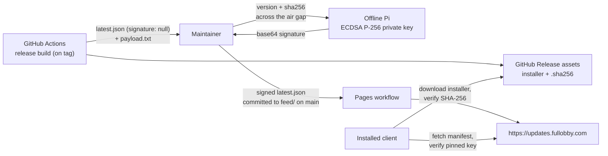

# Update-feed infrastructure — one-time setup (`updates.fullobby.com`)

The self-updater fetches its signed manifests from **`https://updates.fullobby.com`**
(`Branding.DefaultUpdateFeedBaseUrl` / `UpdateConfig.FeedBaseUrl`), a static **GitHub Pages** site
deployed from the **`feed/`** folder on `main` by the **`Deploy update feed (Pages)`** workflow
(`.github/workflows/pages.yml`, Actions → Pages). The client, CI, tests, and docs are already wired
to that host; this file is the runbook for standing up the infra behind it.



## Decision (locked): custom domain, not `github.io`

The feed host is **hardbaked into every shipped client** and a unit test
(`UpdateFeedConfigTests`) pins it to `updates.fullobby.com`. Once the first signature-enforcing release
ships, that URL is **permanent for every client in the wild** — an old client only ever looks where its
binary was built to look, so the URL can never move without abandoning those users.

We use the **custom domain** precisely because of that permanence: `updates.fullobby.com` is a name we
own in Cloudflare DNS, so the feed can be **re-pointed to any host later** (GitHub Pages today,
something else tomorrow) with zero client changes. The `github.io` default
(`cat-tree-gaming-l-l-c.github.io/fullobby-windows/`) was **rejected** — it would weld the feed to
GitHub Pages *and* to the exact org/repo name forever. No code change is needed; the client already
targets the custom domain.

## Prerequisite: the repo must be public

On the org's **Free** plan, GitHub Pages only serves from **public** repositories. Independently, the
manifest's `download_url` points at this repo's **release assets**, which unauthenticated clients can
only download if the repo is public. So publishing the client repo is a hard prerequisite for the
update flow to function at all — not just for Pages.

> If the repo must stay private, the only alternative is hosting both the feed **and** the installer
> assets from a separate *public* repo and changing CI's `download_url`/manifest target. We chose to
> make this repo public instead (the client was always slated to go public).

## Steps

Do these in order. Steps 1–2 are one-time; step 6 verifies.

1. **Make the repo public** — GitHub → Settings → General → Danger Zone → *Change visibility* → Public.
   (CLI: `gh repo edit Cat-Tree-Gaming-L-L-C/fullobby-windows --visibility public --accept-visibility-change-consequences`.)

2. **Add the Cloudflare DNS record** — in the DNS dashboard for `fullobby.com`:
   - Type **CNAME**, Name **`updates`**, Target **`cat-tree-gaming-l-l-c.github.io`** (the *org* Pages
     host — **not** the repo path; GitHub routes to the right site via the `CNAME` file).
   - **Proxy status: DNS only (grey cloud).** Cloudflare's orange-cloud proxy in front of GitHub Pages
     breaks GitHub's automatic Let's Encrypt cert issuance and can cause redirect loops. Leave it
     grey; GitHub terminates TLS itself.
   - TTL: Auto.

3. **Enable GitHub Pages (Actions source)** — Settings → Pages → *Build and deployment* → Source
   **GitHub Actions**. Then run the **`Deploy update feed (Pages)`** workflow (it also runs
   automatically on any push to `main` touching `feed/**`) — Actions → *Deploy update feed (Pages)* →
   *Run workflow*.
   (CLI: `gh api -X POST repos/Cat-Tree-Gaming-L-L-C/fullobby-windows/pages -f 'build_type=workflow'`
   then `gh workflow run 'Deploy update feed (Pages)'`.)

4. **Custom domain** — `feed/CNAME` contains `updates.fullobby.com`, which the deploy carries into the
   published site. Confirm under Settings → Pages → *Custom domain* shows `updates.fullobby.com` with a
   green check once DNS propagates.

5. **Enforce HTTPS** — tick Settings → Pages → *Enforce HTTPS* once the checkbox is enabled (GitHub
   must provision the cert first; can take minutes to a few hours after DNS resolves).

6. **Verify:**
   ```bash
   # DNS points at GitHub Pages (grey-cloud CNAME):
   dig +short updates.fullobby.com        # -> cat-tree-gaming-l-l-c.github.io -> 185.199.108.153 ...
   # Landing page serves over HTTPS with a valid cert:
   curl -fsSI https://updates.fullobby.com/ | head -1
   # Manifests 404 until the first signed release is published (this is the safe state):
   curl -sSI https://updates.fullobby.com/latest.json | head -1   # HTTP/2 404 (expected pre-release)
   ```

## Publishing manifests

Signed `latest.json` / `latest-beta.json` are **not** produced by CI (the signing key is offline). Each
release, the maintainer signs `(version, sha256)` offline and commits the finalized manifest into
`feed/` on `main`; the Pages workflow redeploys within ~1 min. See `feed/README.md` and the private
`fullobby-api` repo `docs/RELEASE-SIGNING.md` (step 5). Until the first signed manifest lands,
`latest.json` 404s and the client reports "no update" — safe, never an unverified update.
